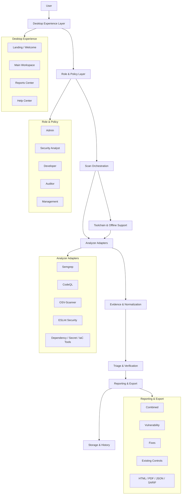

# CodeSentinelX Architecture

CodeSentinelX is organized as a layered desktop security platform. The goal is to keep scanning, evidence collection, triage, reporting, and offline toolchain management separated so the system stays understandable and maintainable.

## High-Level Tree

```text
CodeSentinelX
├── Desktop Experience
│   ├── Landing / Welcome
│   ├── Main Scan Workspace
│   ├── Reports Center
│   └── Help Center
├── Role & Policy Engine
│   ├── Admin
│   ├── Security Analyst
│   ├── Developer
│   ├── Auditor
│   └── Management
├── Scan Orchestration
│   ├── Repository detection
│   ├── Role-based tool planning
│   ├── Job control / progress
│   └── Timeout / retry handling
├── Analyzer Adapters
│   ├── Semgrep
│   ├── CodeQL
│   ├── OSV-Scanner
│   ├── ESLint Security
│   ├── Dependency / secret / IaC tools
│   └── Native-language tools
├── Evidence & Normalization
│   ├── Canonical finding schema
│   ├── Deduplication
│   ├── Confidence scoring
│   └── Source / sink / line evidence
├── Triage & Verification
│   ├── Active PoC validation
│   ├── Fix verification
│   ├── Build / test reruns
│   └── KEV / advisory enrichment
├── Reporting & Export
│   ├── Combined report
│   ├── Vulnerability report
│   ├── Fixes report
│   ├── Existing-controls report
│   └── HTML / PDF / JSON / SARIF exports
├── Storage & History
│   ├── Scan history
│   ├── Report artifacts
│   ├── Integrity hashes
│   └── Local caches
└── Toolchain & Offline Support
    ├── Bundled binaries
    ├── Local pack caches
    ├── Mirror/bootstrap support
    └── Portable laptop transfer
```

## Request Flow

```text
User selects repo + role + preset
        ↓
Desktop UI forwards the request to the backend
        ↓
Role policy decides which analyzers are allowed
        ↓
Repository detection narrows the stack and file scope
        ↓
Adapters run only the matching tools
        ↓
Evidence is normalized, deduped, and triaged
        ↓
Verification attaches PoC / fix / build / test context
        ↓
Reports are rendered in HTML, PDF, JSON, and SARIF
        ↓
History and export artifacts are stored locally
```

## Visual Diagram



### ASCII fallback

```text
User
  ↓
Desktop Experience
  ↓
Role & Policy
  ↓
Scan Orchestration
  ↓
Analyzer Adapters
  ↓
Evidence & Normalization
  ↓
Triage & Verification
  ↓
Reporting & Export
  ↓
Storage & History
  ↘
Toolchain & Offline Support
```

## Design Principles

- Keep scanning logic separate from report rendering.
- Keep role policy separate from tool adapters.
- Keep raw evidence separate from human-friendly summaries.
- Keep offline portability first-class.
- Prefer real execution, real validation, and real file/line evidence over placeholder content.

## Where The Pieces Live

- Desktop UI: `codesentinelx_desktop/`
- Scanner engine: `codesentinelx_engine/`
- Tests: `tests/`
- Deployment helpers: `deploy/`
- Scripts and startup helpers: `run-codesentinelx.ps1`, `setup-windows.ps1`, `run.py`

## Related Docs

- `README.md`
- `README_USER_GUIDE.md`
