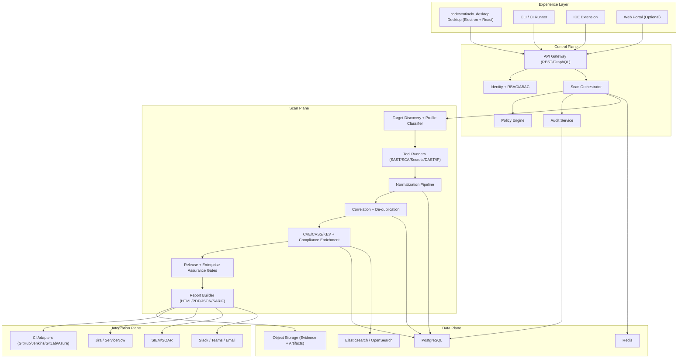
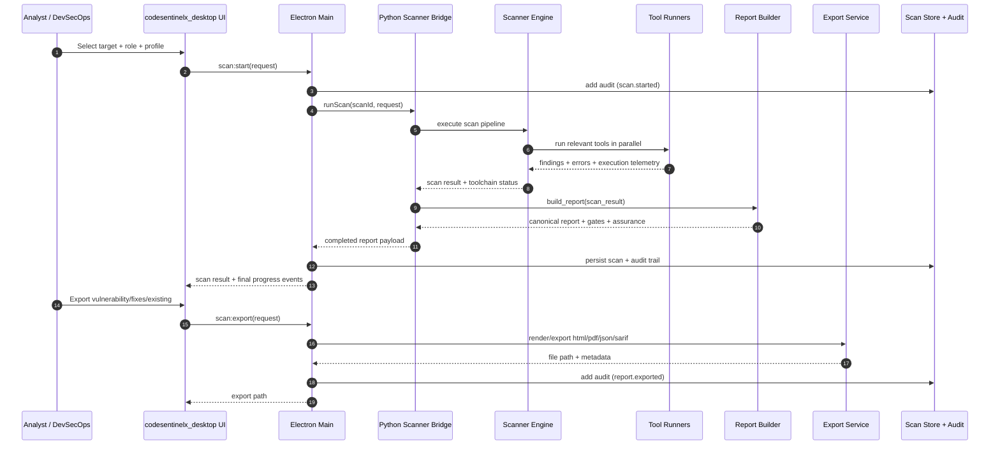

# CodeSentinelX World-Class Architecture Blueprint

## 1) Architecture Goal

Build a security platform that can reliably scan codebases (SAST + SCA + secrets + IaC) and produce executive and developer-grade evidence at enterprise scale.

## 2) Core Principles

- Truth over volume: prioritize validated, explainable findings.
- Profile-driven scanning: codebase analysis only.
- Deterministic pipeline: same input + profile = reproducible output.
- Policy-first governance: release gates and enterprise readiness gates.
- Zero trust operations: least privilege, audit-by-default, immutable evidence.

## 3) Reference System Layers

### A. Experience Layer
- codesentinelx_desktop desktop app (Electron + React): operator UX, live progress, triage.
- Web portal (optional): multi-tenant dashboards, governance, fleet operations.
- CLI: CI/CD and headless automation.
- IDE plugins: pull finding context to code editor.

### B. Control Plane
- API Gateway (REST/GraphQL) with authz and rate limits.
- Identity and Access Service (SSO/OIDC/SAML + RBAC/ABAC).
- Scan Orchestrator (job scheduling, retries, cancellation, pause/resume).
- Policy Engine (release gates, suppression policy, environment rules).
- Audit Service (append-only, tamper-evident action logs).

### C. Scan Plane
- Source discovery and repository classifier.
- Scanner runners:
  - SAST and semantic analyzers.
  - Dependency scanners and CVE intelligence.
  - Secret scanners.
  - Network/IP scanners.
- Normalization pipeline to one finding schema.
- Correlation and deduplication service.

### D. Data Plane
- PostgreSQL: canonical scans/findings/policies/users.
- Elasticsearch/OpenSearch: search, faceting, fast drill-down.
- Redis: scan session state, queue coordination, cache.
- Object storage: report artifacts, evidence bundles, raw tool outputs.

### E. Integration Plane
- CI adapters: GitHub Actions, Jenkins, GitLab CI, Azure DevOps.
- Ticketing adapters: Jira, ServiceNow.
- SOC adapters: SIEM/SOAR webhooks and push feeds.
- Notification channels: email, Slack, Teams.

## 4) Canonical Data Contract

Every tool output must normalize into a canonical finding object with:
- unique id (stable fingerprint),
- file/path/url, line, sink/source context,
- severity + CVSS + confidence,
- CWE + OWASP mapping,
- exploitability intelligence (PoC/KEV/public exploit),
- business impact + remediation guidance,
- evidence and traceability metadata (tool, rule id, raw reference).

## 5) Scan Lifecycle

1. Target intake and profile detection.
2. Preflight checks (auth context, tool readiness, policy readiness).
3. Tool orchestration (parallel where safe).
4. Parse/normalize.
5. Correlate/dedupe.
6. Enrich (CVSS/CVE/KEV/compliance mapping/git diff context).
7. Gate evaluation:
   - release gate (risk-based),
   - enterprise assurance gate (coverage/execution quality-based).
8. Export and persistence.
9. Audit and notification.

## 6) Profile-Based Tool Routing

- Codebase profile:
  - language analyzers, semgrep/codeql class tools, dependency and secrets scanners.
- Website/API profile:
  - authenticated crawl, endpoint discovery, runtime probes, DAST checks.
- IP/Network profile:
  - host discovery, port/service checks, exposure/misconfiguration checks.

Routing rule: only run tools relevant to discovered target characteristics unless policy says forced-full.

## 7) Performance and Scale Design

- Job queue + worker pools per scan profile.
- Tool-level concurrency controls.
- Streaming progress events to UI and APIs.
- Chunked persistence for large finding sets.
- Memory caps per worker and tool timeouts with reasoned retries.
- Horizontal scale for orchestrator/workers/search tier.

## 8) Enterprise Security Controls

- RBAC with project/workspace scopes.
- Owner-only privileged operations (tool provisioning, policy edits).
- Secrets isolation (vault-backed).
- Signed artifacts and report integrity hash.
- Immutable audit trail and retention policy.
- Multi-tenant isolation boundaries.

## 9) Governance and Quality Gates

- Release Gate:
  - Block on Critical/known exploited, optional block on High.
- Enterprise Assurance Gate:
  - required-tool coverage by profile,
  - tool execution success rate,
  - unavailable/no-runner detection,
  - explicit blockers with recommendation.

## 10) Deployment Topologies

- Desktop-first single operator:
  - Electron app + local scanner runtime.
- Enterprise on-prem:
  - API + orchestrator + workers + DB + search + cache + object store.
- SaaS:
  - control plane multi-tenant + isolated worker pools per tenant tier.

## 11) What World-Class Means in Practice

- Findings are explainable and reproducible.
- Reports are executive-ready and developer-actionable.
- Runtime and codebase modes both have authenticated and deep coverage.
- Policy/gate decisions are deterministic and auditable.
- System remains stable under large repositories and long-running runtime scans.

## 12) Implementation Roadmap (Practical)

### Phase 1 (Current baseline hardening)
- Canonical finding schema and strict normalization.
- Enterprise assurance and release gate in reports and CLI.
- Tool execution telemetry visible in UI and exports.

### Phase 2 (Platform scale)
- Queue-backed distributed workers.
- PostgreSQL + search index + artifact storage.
- Multi-project workspaces and centralized policy service.

### Phase 3 (Enterprise operations)
- CI plugins, SOC integrations, signed evidence bundles.
- Differential PR scanning and trend analytics.
- Advanced suppression workflow with approval and expiration.

## 13) Visual: System Architecture

## 14) Visual: Scan + Report Sequence

---------------------------------------------------------------------------------------------------------------

Concrete Implementation Plan (Against Your Current Repo, One Pass)

Scope lock

Keep product strict codebase-only (no runtime/website/IP scans, no tool downloads, no offensive binaries).
Everything below extends your current stack in codesentinelx_engine + codesentinelx_desktop.
Current baseline (already present)

You already have: active safe PoC, fix verification, false-positive section, suppression policy, owner detection, dependency reachability (import evidence), portfolio summary, role-aware report, tool execution evidence.
Main gap: make these features deterministic, auditable, and operational at scale.
Feature-by-feature build plan

Deterministic Evidence Replay Pack
Build: per-finding replay bundle with exact command, tool version, env fingerprint, output hash, replay script.
Add: replay_pack object on each finding + export folder C:\\Users\\sanketa\\Documents\\CodeSentinelX_Reports\\export\\replay\\<scan_id>\\<finding_uid>/.
Files:
codesentinelx_engine/scanner/engine.py
codesentinelx_engine/scanner/reporting/report_builder.py
codesentinelx_engine/scanner/reporting/exporters.py
codesentinelx_desktop/backend/types.ts
codesentinelx_desktop/frontend/src/types.ts
codesentinelx_desktop/backend/exportService.ts
codesentinelx_desktop/frontend/src/App.tsx
Fix Verification Simulator
Build: run suggested fix in temp workspace, score compile/test/security delta/side-effects.
Add simulator module and result fields: fix_verification.compile_ok, tests_ok, finding_removed, side_effect_risk, verification_score.
Files:
codesentinelx_engine/scanner/reporting/report_builder.py
codesentinelx_engine/scanner/scan_control.py
codesentinelx_engine/scanner/file_discovery.py
codesentinelx_desktop/backend/types.ts
codesentinelx_desktop/frontend/src/App.tsx
Suppression Drift Radar
Build: aging buckets, expired suppressions, repeated suppressions by module/owner, suppression debt score trend.
Extend current suppression output into time series from scan history.
Files:
codesentinelx_engine/scanner/reporting/report_builder.py
codesentinelx_desktop/database/store.ts
codesentinelx_desktop/frontend/src/App.tsx
codesentinelx_desktop/backend/types.ts
Finding-to-Test Generator
Build: auto-generate regression tests for High/Critical findings (Python/JS/TS + config checks).
Output only generated artifacts and instructions, no auto-commit.
Files:
codesentinelx_engine/scanner/reporting/report_builder.py
codesentinelx_engine/scanner/reporting/exporters.py
codesentinelx_desktop/backend/exportService.ts
codesentinelx_desktop/frontend/src/App.tsx
Code-Owner Weighted Prioritization
Build: upgrade formula to include owner backlog/capacity from local history and optional policy file.
Formula: exploitability × business impact × reachability × owner_load_factor × confidence.
Files:
codesentinelx_engine/scanner/reporting/report_builder.py
codesentinelx_desktop/database/store.ts
codesentinelx_desktop/frontend/src/App.tsx
Blast Radius Graph (Code + Config)
Build: graph from imports, manifests, docker/compose, terraform, service config; map finding impact radius.
Add leadership-friendly graph summary + top downstream at-risk modules.
Files:
codesentinelx_engine/scanner/reporting/report_builder.py
codesentinelx_engine/scanner/file_discovery.py
codesentinelx_desktop/frontend/src/App.tsx
codesentinelx_desktop/backend/types.ts
Patch Pattern Memory (Org-specific)
Build: local memory of accepted fixes keyed by finding pattern + language + context.
Use memory to rank future suggestions.
Files:
codesentinelx_desktop/database/store.ts
codesentinelx_engine/scanner/reporting/report_builder.py
codesentinelx_desktop/frontend/src/App.tsx
Secure Coding Contract Score
Build: per-module contract metrics (validation/auth/crypto/logging/config hygiene) with trend.
Source from controls + findings + suppressions.
Files:
codesentinelx_engine/scanner/controls/analyzer.py
codesentinelx_engine/scanner/reporting/report_builder.py
codesentinelx_desktop/frontend/src/App.tsx
Confidence-for-Action Model
Build: separate detection confidence and fix confidence; release gate on high-confidence exploitable findings.
Remove “severity-only” gate behavior.
Files:
codesentinelx_engine/scanner/reporting/report_builder.py
codesentinelx_desktop/backend/types.ts
codesentinelx_desktop/frontend/src/App.tsx
Tamper-Evident Report Chain
Build: hash chain per scan + signed manifest for exported artifacts.
Include previous_hash, artifact_hashes, chain_valid.
Files:
codesentinelx_engine/scanner/reporting/exporters.py
codesentinelx_desktop/backend/exportService.ts
codesentinelx_desktop/database/store.ts
codesentinelx_desktop/frontend/src/App.tsx
Dependency Reachability + Runtime Evidence Hooks
Build: keep codebase-only, but enrich reachability with test coverage traces (coverage.xml, lcov.info, jacoco.xml) and import/use evidence.
Files:
codesentinelx_engine/scanner/reporting/report_builder.py
codesentinelx_engine/scanner/rules/dependency_rules.py
Security Debt Forecast
Build: 30/60/90 risk forecast from open risk, fix velocity, suppression drift, tool reliability.
Add confidence band and forecast assumptions.
Files:
codesentinelx_engine/scanner/reporting/report_builder.py
codesentinelx_desktop/database/store.ts
codesentinelx_desktop/frontend/src/App.tsx
